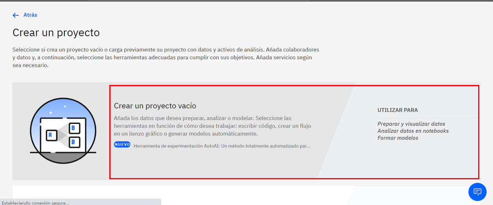
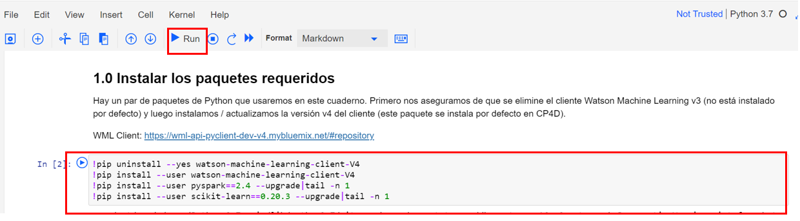
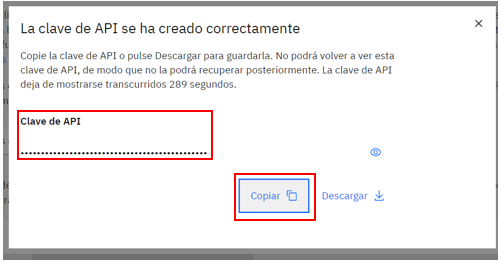

# Predecir la rotación de clientes con Watson Machine Learning y Jupyter Notebooks en Cloud Pak for Data

En este patrón de código, utilizamos IBM Cloud Pak for Data para recorrer todo el proceso de ciencia de datos para resolver un problema comercial y predecir la rotación de clientes mediante un conjunto de datos de rotación de clientes de Telco. Cloud Pak for Data es un entorno interactivo, colaborativo y basado en la nube donde los científicos de datos, los desarrolladores y otras personas interesadas en la ciencia de datos pueden usar herramientas (por ejemplo, RStudio, Jupyter Notebooks, Spark, etc.) para colaborar, compartir y recopilar información. a partir de sus datos, así como crear e implementar modelos de aprendizaje automático y aprendizaje profundo.

Cuando el lector haya completado este patrón de código, comprenderá cómo:

* Utilice [Jupyter Notebooks](https://jupyter.org/) para cargar, visualizar y analizar datos
* Ejecute Notebooks en [IBM Cloud Pak for Data](https://www.ibm.com/analytics/cloud-pak-for-data)
* Cree, pruebe e implemente un modelo de aprendizaje automático con [Spark MLib](https://spark.apache.org/mllib/) en Cloud Pak for Data.
* Implementar un modelo de aprendizaje automático seleccionado en producción con Cloud Pak for Data
* Cree una aplicación front-end para interactuar con el cliente y comience a consumir su modelo implementado.

## Pre-requisitos
TO-DO: Checar enlaces y ver 
- Tener una cuenta de [IBM Cloud](https://cloud.ibm.com)
- Tener instalado [IBM Cloud Pak for Data as a Service](https://www.ibm.com/analytics/cloud-pak-for-data)

## Cupones para profesores y estudiantes:
- Acceder al portal de IBM Academic Initiative y seleccionar la opción "Register now" si aun no tienes cuenta.
- Realizar el registro correspondiente utilizando la cuenta de correo académica y confirma tu cuenta.
- Despues de confirmar tu cuenta, y con la sesion iniciada en IBM Academic Initiative, en la parte de "Most Popular Topics covered", encontraremos IBM Cloud y damos clic en "Learn more".
- Bajamos de la pagina hasta encontrar "Software". Le damos clic, nos dara un apartado que se llama "Request Feature Code".
- Nos dara nuestro codigo. Lo copiamos y lo llevamos a IBM Cloud.

## Cargar créditos en IBM Cloud:
- En la parte superior derecha, buscaremos la parte de "MANAGE"/"GESTIONAR", nos desplegara una lista y seleccionaremos "Account"/"Cuenta".
- De lado izquierdo, tendremos una opción "Account settings"/"Configuracion de cuenta".
- Bajamos un poco hasta encontrar "Subscription and feature codes"/"Codigos de suscripción y carateristicas".
- Da clic en "Apply code"/"Aplicar codigo".
- Ingresamos el codigo y clic en "Apply"/"Aplicar".

## Contenido 
1. [Crear una instancia de Object Storage](#1-Crear-una-instancia-object-storage)
2. [Crear una instancia de Machine Learning](#2-Crear-una-instancia-machine-learning)
3. [Crear una instancia de Watson Studio](#3-Crear-una-instancia-watson-studio)
4. [Crear un proyecto en watson studio](#4-Crear-proyecto-en-watson-studio)
5. [Agregar Notebook y CSV al proyecto](#5-Agregar-notebook-y-papeles-al-proyecto)
6. [Ejecutar el cuaderno](#6-Ejecutar-el-cuaderno)
7. [Implementar el modelo con la interfaz de usuario de Cloud Pak for Data](#7-Implementar el modelo con la interfaz de usuario de Cloud Pak for Data)

### 1-Crear-una-instancia-object-storage
1. En el catálogo buscar "Object Storage" y seleccionarlo.

  

2. Crear el servicio. Seleccionar el plan gratuito "Lite". Dar scroll hacia abajo y elegir un nombre para el servicio. Dar click en "Crear".

  
  

### 2-Crear-una-instancia-machine-learning
1. En el catálogo buscar "Machine Learning" y seleccionarlo.

  

2. Crear el servicio. Seleccionar el plan gratuito "Lite". Dar scroll hacia abajo y elegir un nombre para el servicio. Dar click en "Crear".

  
  

### 3-Crear-una-instancia-watson-studio
1. En el catálogo buscar "Watson Studio" y seleccionarlo.

  

2. Crear el servicio. Seleccionar el plan gratuito "Lite". Dar scroll hacia abajo y elegir un nombre para el servicio. Dar click en "Crear".

  
  

### 4-Crear-proyecto-en-watson-studio
1. Una vez creada la instancia, se abrirá el servicio creado. Dar click en "Iniciación"

  

2. Se abrirá una nueva pestaña. Dar click en "Crear proyecto".

  

3. Seleccionar "Crear un proyecto vacío".

  

4. Elegir el nombre del proyecto. En almacenamiento debe aparecer el nombre de la instancia que se creo de Object Storage (si es la única que se tiene en la cuenta), si no aparece, elegirla. Dar click en "Crear" 

  

### 5-Agregar-notebook-y-papeles-al-proyecto
1. En el proyecto abierto, dar click en "Añadir al proyecto" para agregar el notebook. Se abre un modal y dar click en "Notebook".

  

  

            

2. Se abre la ventana de Nuevo Notebook. Seleccionar el tab "Desde URL". Elegir un nombre para el notebook e insertar la URL del notebook que esta en ese repositorio. Dar click en "Crear"

  

3. Automáticamente se abrirá el notebook pero se debe agregar otro archivo es por eso que hay que dar click derecho en "prediction-workshop" y seleccionar "Abrir nueva pestaña" para abrir otra tab y agregar un csv.

  

4. En la nueva pestaña del navegador. Dar click en "Activos"(1). Dar click en el botón del lado derecho de circulitos(2). Subir el csv "Telco-Customer-Churn.csv" que se podrá descargar desde este mismo repositorio en la carpeta "Data"(3).

  

5. Verificar que se ha cargado correctamente el archivo. Debe aparecer en la tabla de "Activos de Datos". 

  

6. En la misma ventana del proyecto dar scroll hacia abajo para llegar a la sección "Señales de Acceso". Dar click en "Nueva señal"(1). Se abrirá un modal. Asignar un nombre a la señar y elegir el rol de "Editor". Dar click en "Crear".

  

7. En la misma ventana ir a la tabla de "Notebooks". En la fila del notebook que agregamos dar click en el candado. Aparecerá un modal. Dar click en "Desbloquear".

  

### 6-Ejecutar-el-cuaderno
1. En la pestaña donde tenemos abierto nuestro notebook. Dar click en el ícono de tres puntos" y dar click en "Insertar señal del proyecto". Automáticamente se agregara un pedazo de código hasta arriba. Dar click en "Run" a esa sección de código.

  

2. Continuar seleccionando los bloques de código y dar click en "Run" para que se ejecuten. Continuar con hasta terminar el paso 1.0.

  
  

3. En el paso 2.0, seleccionar dar click abajo de donde dice "Insertar código de Pandas". Dar click en el ícono de circulitos (2) y donde dice "Insertar Código", seleccionar "pandas DataFrame". Automáticamente se agregará un pedazo de código, una vez agregado, dar click en "Run". Se mostrará una tabla.

  
  
  

4. Continuar ejecutando los siguientes bloques de código y visualizar los resultados. Terminar de ejecutar todas las celdas del paso 2.0 y 3.0

  
  

5. En el paso 4.0 se debe modificar el valor de la constante DEPLOYMENT_SPACE_NAME. Para esto, en la ventana del proyecto, dar click en el ícono de menú de hamburguesa del lado izquierdo para que muestre una lista de opciones. Dar click en "Espacios de Despliegue". 

  

6. Se abrirá la sección de "Despiegues". Dar click en "Nuevo Espacio de Despliegue"

  

7. Seleccionar un nombre para el espacio y dar click en "Crear"

  

8. Una vez que esté listo, dar click en "Ver nuevo espacio"

  

9. En el notebook, poner a la variable DEPLOYMENT_SPACE_NAME el valor del nombre de nuestro espacio de despliegue.

  

10. En la pestaña del espacio de despliegue. Dar click en "Gestionar" y copiar en un block de notas el valor de "Espacio GUID"

  

11. En el paso 4.1 se generará una API KEY. Dar click en el enlace y se abrirá una nueva pestaña.

  

12. En la nueva pestaña dar click en el botón azul para generar una nueva API KEY.

  

13. Elegir un nombre para la llave y dar click en "Crear"

  

14. Copiar en un block de notas la llave generada (la necesitaremos más adelante)

  

15. En el notebook vamos a copiar lo que aparece seleccionado en la imagen y lo copiarlo en una línea de comandos.

  

16. Sustituir API_KEY por la llave que copiamos anteriormente en el block de notas. 

  

17. La consola nos va a devolver un valor de access_token. Este valor copiarlo.

  

18. Copiar ese access token donde dice "token" en el notebook y posteriormente dar click en "RUN" para ejecutar la celda.

  

19. Seguir ejecutanto las celdas hasta llegar al final del notebook.

  

### 7-Implementar el modelo con la interfaz de usuario de Cloud Pak for Data

